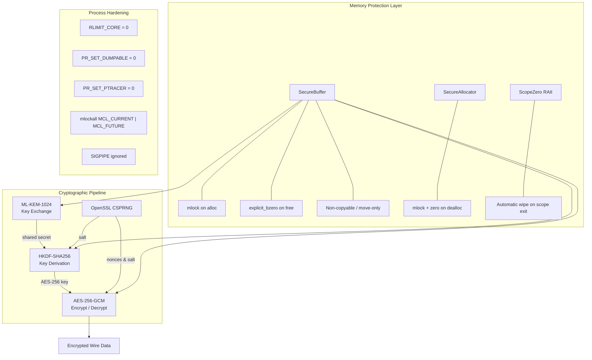
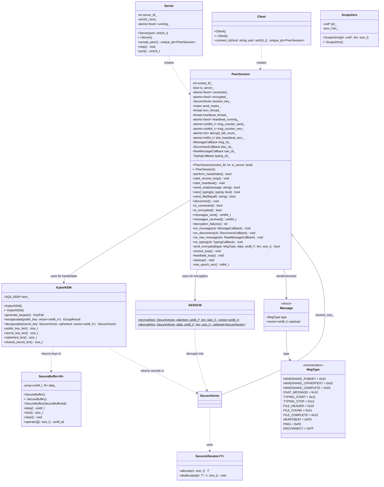
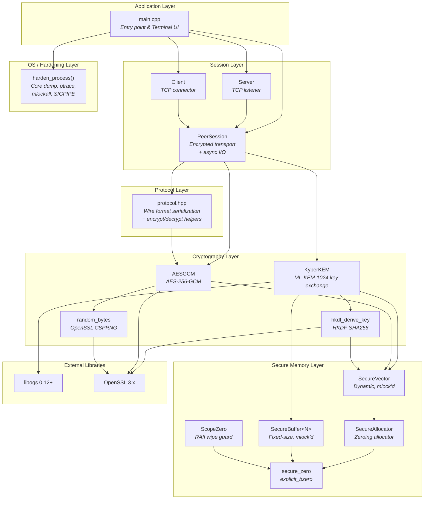
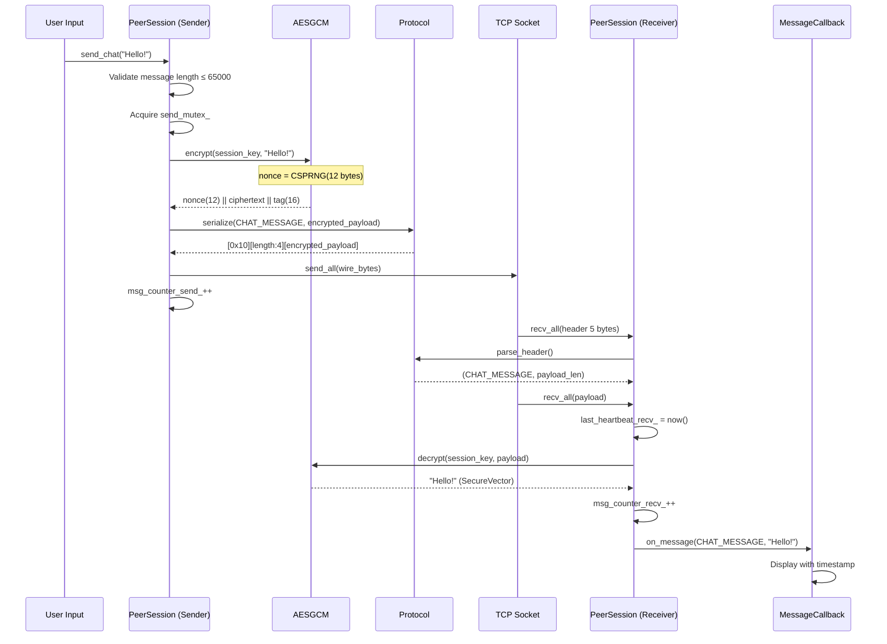
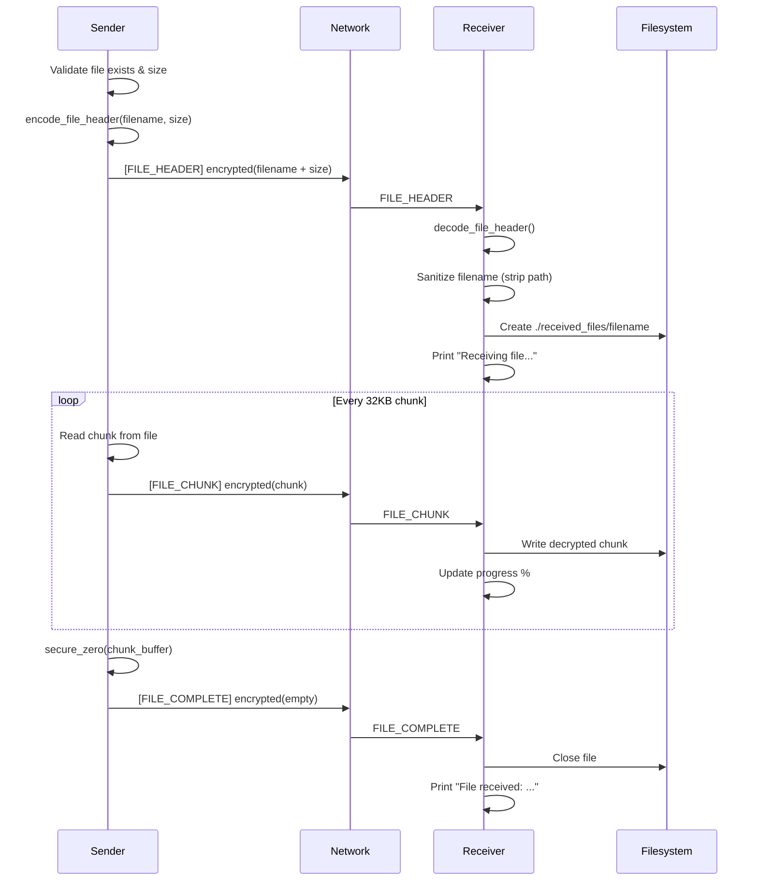
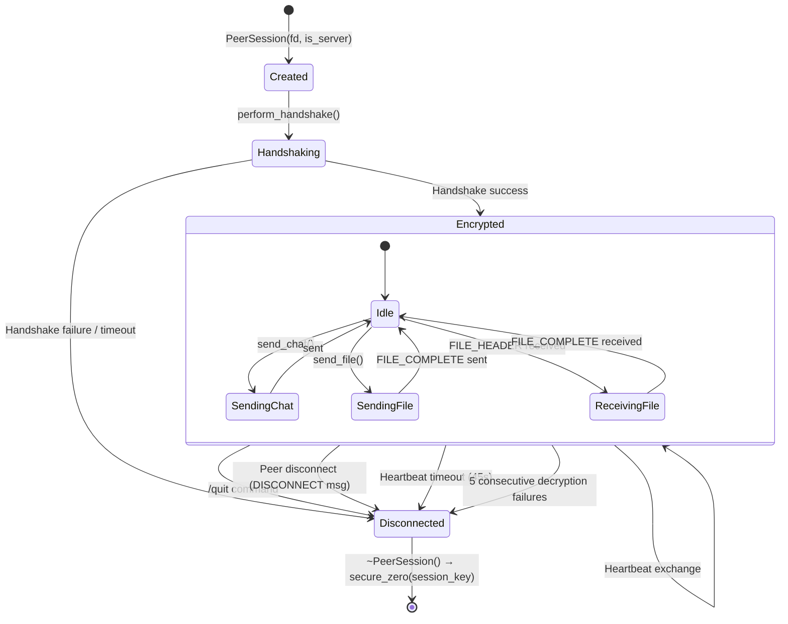
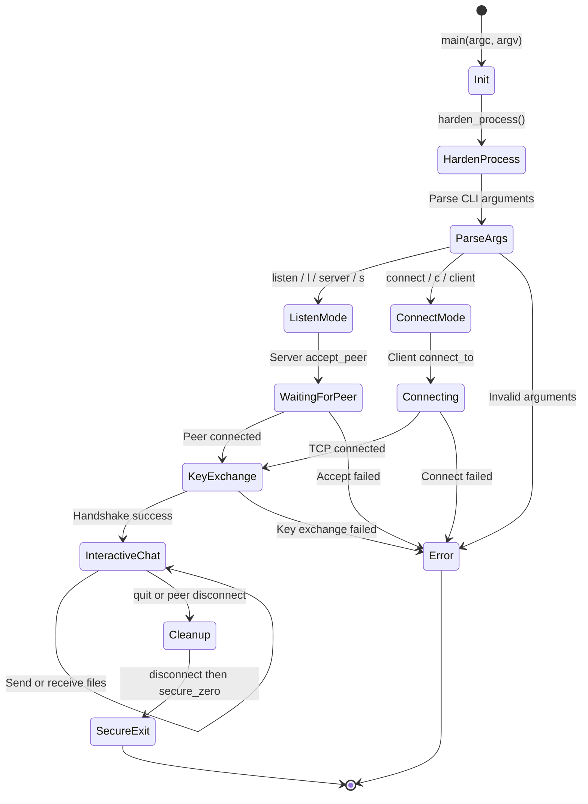
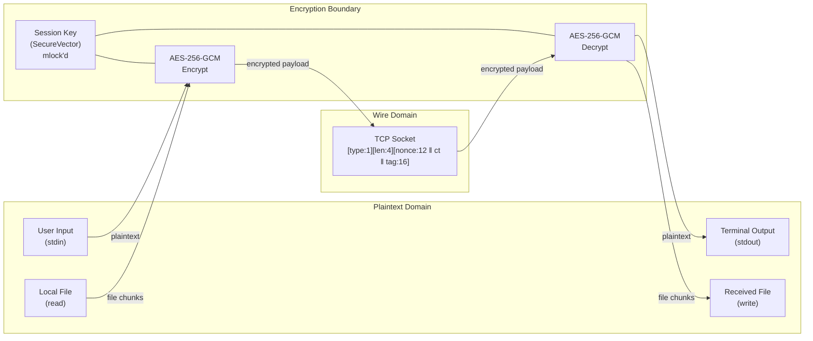
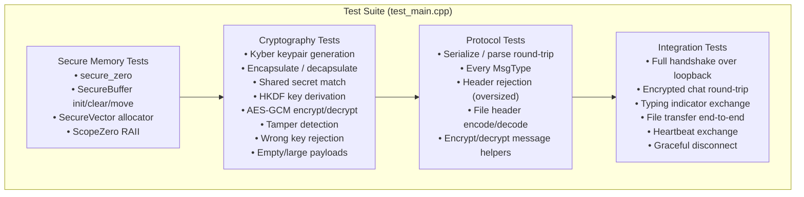

<p align="center">
  <strong>SecureP2P</strong><br>
  <em>Quantum-Safe Encrypted Peer-to-Peer Chat &amp; File Transfer</em>
</p>

<p align="center">
  
  
  
  
  
</p>

---

A **hardened**, terminal-based **peer-to-peer** chat and file transfer application using **post-quantum cryptography** (ML-KEM-1024 / Kyber) for key exchange and **AES-256-GCM** for authenticated encryption. Designed to resist both classical and quantum-computer attacks while operating in hostile network environments.

---

## Table of Contents

- [Quick Start](#quick-start)
- [Features](#features)
- [Security Architecture](#security-architecture)
- [Building from Source](#building-from-source)
- [Usage](#usage)
- [Architecture & Design](#architecture--design)
  - [Project Structure](#project-structure)
  - [Class Diagram](#class-diagram)
  - [Component Diagram](#component-diagram)
  - [Sequence Diagrams](#sequence-diagrams)
  - [State Machine Diagrams](#state-machine-diagrams)
  - [Data Flow Diagram](#data-flow-diagram)
- [Wire Protocol](#wire-protocol)
- [Testing](#testing)
- [Threat Model](#threat-model)
- [License](#license)

---

## Quick Start

> **Prerequisites**: GCC 9+ (or Clang 10+), CMake 3.10+, OpenSSL 3.x, liboqs 0.12+

```bash
# 1. Clone the repository
git clone https://github.com/yourusername/SecureP2P.git
cd SecureP2P

# 2. Install liboqs (skip if already installed)
git clone --depth 1 --branch 0.12.0 https://github.com/open-quantum-safe/liboqs.git
cd liboqs && mkdir build && cd build
cmake -GNinja -DCMAKE_INSTALL_PREFIX=/usr/local -DBUILD_SHARED_LIBS=ON ..
ninja && sudo ninja install && sudo ldconfig
cd ../..

# 3. Build SecureP2P
mkdir -p build && cd build
cmake ..
make -j$(nproc)

# 4. Run the tests
./secureP2P_tests

# 5. Start chatting!
#    Terminal 1 (listener):
./secureP2P listen

#    Terminal 2 (connector):
./secureP2P connect 127.0.0.1
```

Once both terminals display `[+] Quantum-safe session established!`, type messages and press Enter. Use `/file <path>` to send files, `/status` to inspect the connection, and `/quit` to exit securely.

---

## Features

| Category | Feature | Details |
|----------|---------|---------|
| **Encryption** | Post-quantum key exchange | ML-KEM-1024 (FIPS 203 / Kyber) via liboqs |
| **Encryption** | Authenticated encryption | AES-256-GCM with random 96-bit nonces |
| **Encryption** | Key derivation | HKDF-SHA256 with session-unique salt |
| **Encryption** | CSPRNG | OpenSSL `RAND_bytes` for all random data |
| **Chat** | Real-time messaging | Low-latency TCP with `TCP_NODELAY` |
| **Chat** | Typing indicators | Live "peer is typing..." with 2s debounce |
| **Chat** | Timestamps | `[HH:MM:SS]` on all received messages |
| **File Transfer** | Encrypted chunked transfer | 32 KB chunks, each individually encrypted |
| **File Transfer** | Progress bar | Real-time `%` progress on send and receive |
| **File Transfer** | Name collision handling | Automatic rename (`file_1.pdf`, `file_2.pdf`, ...) |
| **Reliability** | Heartbeat | 15s interval, 45s timeout, auto-disconnect on dead peer |
| **Reliability** | TCP keepalive | OS-level dead-peer detection (30s idle, 10s probe, 3 retries) |
| **Reliability** | Tamper detection | Auto-disconnect after 5 consecutive decryption failures |
| **Hardening** | Memory locking | All keys/secrets `mlock()`'d — never swapped to disk |
| **Hardening** | Secure erase | `explicit_bzero()` on all sensitive data at scope exit |
| **Hardening** | Core dumps disabled | `RLIMIT_CORE=0` + `PR_SET_DUMPABLE=0` |
| **Hardening** | Anti-ptrace | Process marked non-dumpable, ptrace blocked |
| **Hardening** | Non-copyable keys | `SecureBuffer` move-only semantics prevent duplication |
| **Hardening** | Zeroing allocator | `SecureAllocator` wipes freed heap memory |
| **Hardening** | Stack protection | `-fstack-protector-strong`, `_FORTIFY_SOURCE=2` |
| **Hardening** | ASLR / RELRO | PIE binary, full RELRO, non-executable stack |

---

## Security Architecture



---

## Building from Source

### Dependencies

| Dependency | Version | Purpose |
|------------|---------|---------|
| C++ compiler | GCC 9+ / Clang 10+ | C++17 support required |
| CMake | 3.10+ | Build system |
| OpenSSL | 3.x | AES-256-GCM, HKDF-SHA256, CSPRNG |
| liboqs | 0.12+ | ML-KEM-1024 (Kyber) post-quantum KEM |
| pkg-config | any | Locates liboqs |

### Installing liboqs

```bash
git clone --depth 1 --branch 0.12.0 https://github.com/open-quantum-safe/liboqs.git
cd liboqs && mkdir build && cd build
cmake -GNinja -DCMAKE_INSTALL_PREFIX=/usr/local -DBUILD_SHARED_LIBS=ON ..
ninja && sudo ninja install && sudo ldconfig
```

### Building

```bash
# Standard build
mkdir -p build && cd build
cmake ..
make -j$(nproc)

# Debug build (with AddressSanitizer)
cmake -DCMAKE_BUILD_TYPE=Debug ..
make -j$(nproc)
```

### Build Outputs

| Target | Description |
|--------|-------------|
| `build/secureP2P` | Main application binary |
| `build/secureP2P_tests` | Test suite binary |

### Compiler Hardening Flags (applied automatically)

```
-Wall -Wextra -O2
-fstack-protector-strong
-D_FORTIFY_SOURCE=2
-fPIE
-pie -Wl,-z,relro,-z,now,-z,noexecstack
```

---

## Usage

### Start a Listener (Peer A)

```bash
./secureP2P listen [port]
# Aliases: l, server, s
# Default port: 9876
```

### Connect to a Peer (Peer B)

```bash
./secureP2P connect <host> [port]
# Aliases: c, client
# Default port: 9876
```

### Interactive Commands

| Command | Alias | Description |
|---------|-------|-------------|
| `/file <path>` | — | Send a file (absolute or relative path) |
| `/quit` | `/exit`, `/q` | Disconnect and exit securely |
| `/help` | `/h` | Show available commands |
| `/status` | `/s` | Show connection info, message counters, encryption status |

### Example Session

```
# Terminal 1 — Listener
$ ./secureP2P listen 9876
[*] Listening on port 9876 ... waiting for peer
[+] Peer connected from 127.0.0.1:54321
[*] Performing ML-KEM-1024 key exchange...
[+] Quantum-safe session established!
    Cipher: AES-256-GCM | KEM: ML-KEM-1024
    Type /help for commands

you> Hello! This is quantum-safe encrypted chat.
[14:30:05] peer> Hey! Sending you a file now.
[<] Receiving file: document.pdf (1048576 bytes)
[<] Receiving: 100% (1048576/1048576 bytes)
[+] File received: ./received_files/document.pdf (1048576 bytes)
you> Got it. /quit
[*] Disconnecting...
[*] Cleaning up secure session...
[+] Session terminated securely.
```

```
# Terminal 2 — Connector
$ ./secureP2P connect 127.0.0.1 9876
[*] Connecting to 127.0.0.1:9876 ...
[+] Connected to 127.0.0.1:9876
[*] Performing ML-KEM-1024 key exchange...
[+] Quantum-safe session established!
    Cipher: AES-256-GCM | KEM: ML-KEM-1024

[14:30:03] peer> Hello! This is quantum-safe encrypted chat.
you> Hey! Sending you a file now.
you> /file /path/to/document.pdf
[>] Sending: 100% (1048576/1048576 bytes)
[+] File sent: document.pdf (1048576 bytes)
[*] Peer disconnected
```

---

## Architecture & Design

### Project Structure

```
SecureP2P/
├── CMakeLists.txt           # Build configuration with hardening flags
├── LICENSE                  # MIT License
├── README.md                # This file
├── include/
│   ├── common.hpp           # Constants, MsgType enum, color codes, harden_process()
│   ├── secure_memory.hpp    # SecureBuffer<N>, SecureVector, SecureAllocator, ScopeZero
│   ├── crypto.hpp           # KyberKEM, AESGCM, hkdf_derive_key(), random_bytes()
│   ├── protocol.hpp         # Wire format: serialize, parse_header, encrypt/decrypt helpers
│   ├── network.hpp          # PeerSession class, send_all/recv_all, send/recv_message
│   ├── server.hpp           # Server class (TCP listener, accepts one peer)
│   └── client.hpp           # Client class (TCP connector)
├── src/
│   ├── crypto.cpp           # ML-KEM-1024, AES-256-GCM, HKDF-SHA256 implementations
│   ├── network.cpp          # PeerSession: handshake, receive loop, heartbeat, file transfer
│   ├── server.cpp           # Server::accept_peer() — bind, listen, accept
│   ├── client.cpp           # Client::connect_to() — socket, connect
│   └── main.cpp             # Entry point, interactive terminal UI, callback wiring
├── tests/
│   └── test_main.cpp        # Comprehensive test suite (memory, crypto, protocol, integration)
└── build/                   # Build output directory
```

### Class Diagram



### Component Diagram



### Sequence Diagrams

#### Connection & Handshake

```mermaid
sequenceDiagram
    participant A as Peer A (Listener)
    participant S as Server
    participant N as Network (TCP)
    participant C as Client
    participant B as Peer B (Connector)

    Note over A: harden_process()
    Note over B: harden_process()

    A->>S: Server(port)
    S->>N: bind() + listen()
    Note over S: Waiting for connection...

    B->>C: Client::connect_to(host, port)
    C->>N: socket() + connect()
    N-->>S: accept()
    S-->>A: PeerSession(fd, is_server=true)
    C-->>B: PeerSession(fd, is_server=false)

    Note over A,B: === ML-KEM-1024 Key Exchange ===

    rect rgb(40, 40, 80)
        A->>A: KyberKEM::generate_keypair()
        Note right of A: (public_key, secret_key)
        A->>N: HANDSHAKE_PUBKEY [public_key]
        N->>B: HANDSHAKE_PUBKEY [public_key]

        B->>B: KyberKEM::encapsulate(public_key)
        Note left of B: (ciphertext, shared_secret)
        B->>N: HANDSHAKE_CIPHERTEXT [ciphertext]
        N->>A: HANDSHAKE_CIPHERTEXT [ciphertext]

        A->>A: KyberKEM::decapsulate(secret_key, ciphertext)
        Note right of A: shared_secret recovered
        A->>A: Generate random salt (32 bytes)
        A->>A: hkdf_derive_key(shared_secret, salt)
        Note right of A: session_key (AES-256)
        A->>A: secure_zero(shared_secret)

        A->>N: HANDSHAKE_COMPLETE [salt]
        N->>B: HANDSHAKE_COMPLETE [salt]

        B->>B: hkdf_derive_key(shared_secret, salt)
        Note left of B: session_key (AES-256)
        B->>B: secure_zero(shared_secret)

        B->>N: HANDSHAKE_COMPLETE []
        N->>A: HANDSHAKE_COMPLETE []
    end

    Note over A,B: ✓ Both peers now share identical AES-256 session key

    A->>A: start_heartbeat() + start_receive_loop()
    B->>B: start_heartbeat() + start_receive_loop()
```



#### Encrypted Chat Message Flow



#### File Transfer Flow



### State Machine Diagrams

#### PeerSession Lifecycle



#### Application State Machine



### Data Flow Diagram



---

## Wire Protocol

### Frame Format

```
┌──────────┬────────────────────────┬───────────────────────────────────┐
│ Type (1) │ Payload Length (4, BE) │ Payload (variable length)         │
└──────────┴────────────────────────┴───────────────────────────────────┘
```

For encrypted messages, the payload contains:

```
┌───────────────┬──────────────────────────────┬────────────────┐
│ Nonce (12 B)  │ Ciphertext (variable)        │ GCM Tag (16 B) │
└───────────────┴──────────────────────────────┴────────────────┘
```

### Message Types

| Code | Name | Direction | Encrypted | Description |
|------|------|-----------|-----------|-------------|
| `0x01` | `HANDSHAKE_PUBKEY` | Server → Client | No | ML-KEM-1024 public key |
| `0x02` | `HANDSHAKE_CIPHERTEXT` | Client → Server | No | Encapsulated ciphertext |
| `0x03` | `HANDSHAKE_COMPLETE` | Both | No | Acknowledgment (server sends salt) |
| `0x10` | `CHAT_MESSAGE` | Both | Yes | Chat text (≤ 65 KB) |
| `0x11` | `TYPING_START` | Both | Yes | Peer started typing |
| `0x12` | `TYPING_STOP` | Both | Yes | Peer stopped typing |
| `0x20` | `FILE_HEADER` | Sender → Receiver | Yes | `name_len(4) \|\| name \|\| file_size(8)` |
| `0x21` | `FILE_CHUNK` | Sender → Receiver | Yes | File data chunk (≤ 32 KB) |
| `0x22` | `FILE_COMPLETE` | Sender → Receiver | Yes | End-of-file marker |
| `0xFD` | `HEARTBEAT` | Both | No | Keep-alive ping (every 15s) |
| `0xFE` | `PING` | Both | No | One-shot liveness probe |
| `0xFF` | `DISCONNECT` | Both | No | Graceful shutdown |

### File Header Encoding

```
┌──────────────────┬──────────────────────────┬────────────────────────┐
│ name_len (4, BE) │ filename (name_len bytes) │ file_size (8, BE)     │
└──────────────────┴──────────────────────────┴────────────────────────┘
```

---

## Testing

The test suite covers four layers:



### Running Tests

```bash
cd build

# Run directly
./secureP2P_tests

# Or via CTest
ctest --output-on-failure
```

---

## Threat Model

| Threat | Mitigation |
|--------|------------|
| **Quantum computer (CRQC)** | ML-KEM-1024 key exchange is NIST PQC standard (FIPS 203) — resistant to Shor's algorithm |
| **Network eavesdropping** | All messages encrypted with AES-256-GCM; nonces are per-message random |
| **Message tampering** | GCM authentication tag detects any modification; 5 failures = auto-disconnect |
| **Key extraction via swap** | All secrets are `mlock()`'d; `mlockall()` at process start |
| **Key extraction via core dump** | Core dumps disabled (`RLIMIT_CORE=0`); process marked non-dumpable |
| **Key extraction via ptrace** | `PR_SET_DUMPABLE=0` + `PR_SET_PTRACER=0` |
| **Key duplication bugs** | `SecureBuffer` is non-copyable (move-only) |
| **Dangling secrets in memory** | `SecureAllocator` + `ScopeZero` ensure all freed memory is wiped |
| **Buffer overflow** | `-fstack-protector-strong`, `_FORTIFY_SOURCE=2`, bounds-checked message sizes |
| **Dead peer hanging** | TCP keepalive (30s/10s/3) + application heartbeat (15s/45s timeout) |
| **Replay attacks** | Random nonces per message; message counters track send/recv volumes |

---

## License

This project is licensed under the **MIT License** — see [LICENSE](LICENSE) for details.

Copyright (c) 2026 fl4nk3r
